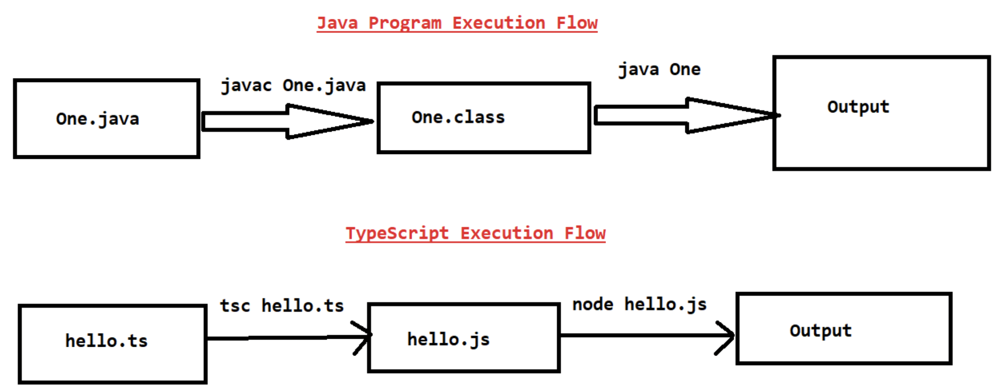
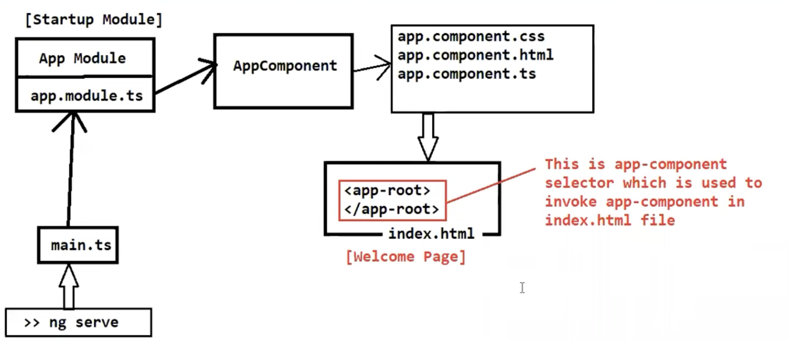
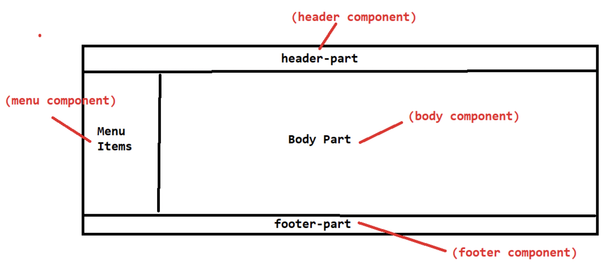

# Angular - Typescript

<details>
<summary>
Introduction
</summary>

---

- Now a days in the industry companies are following Microservice architecture to develop the applications.

- Microservice is an Architectural Design Pattern which is used to develop our applications with loosely coupling and easy maintenence.

- As part of this Microservice architecture we will develop business logics as Rest Apis.

- REST APIS are for B 2 B communication (Business to Business Communication).


>**Fullstack Development** : Backend Development (REST API's) + Frontend Development (UI)

- As a fullstack developer we are going to develop web applications using frontend and backend.

---
</details>
<details>
<summary>
What is a web application?
</summary>

---

- The application which runs in server is called as web application.
- Multiple users can access web applications at a time by using internet.

	>Ex: Facebook, Gmail, IRCTC etc.....

- Now a days web applications are divided into 2 types
```
	1. Multi page web applications (MPA)
	2. Single page web applications (SPA)
```
- In `Multi page web applications` for every request new web page will be loaded at client side. Here everytime entire page will be reloaded.

- In `Single page web applications` web page will be loaded only for first request. From second request onwards only content will be updated without reloading the entire page.

>Ex : Gmail, angular.io etc....

---

</details>
<details>
<summary>
Advantages of SPA
</summary>

---

- Development will be easy

- Maintenance will be simple

- Good Performance

>Note: In single page application common content will be loaded only one time.

---

</details>

<details>
<summary>
Angular Introduction
</summary>

---

- Angular is a client side framework

- Angular is used to create Web Applications

- Angular is mainly used for Single Page Applications Development.

- Angular supports all platforms (Desktop and Mobile)

- Angular is free & open source

- Angular is having cross-browser compatibility

- Angular developed by Google.

---

</details>

<details>
<summary>
Angular JS and Angular Framework
</summary>

---

- The initial version of Angular is called as Angular JS (Angular 1.x verions) which is developed by using Java Script.

- After few days Google realized the problems with Angular JS then they started developing one new framework to develop web applications thats where Angular Famework came into Market. This Angular framework is developed by using Type Script.

- From Version 2.0 onwards it is called as Angular Framework

- Angular 2.0 is not enhancement for Angular 1.0 because in 2.0 version Google Developers completley re-written Angular framework by using TypeScript.

- TypeScript developed by Microsoft Company.

- Angular 2+ versions are extensions for Angular 2.0 version

- Angular 1.x versions are called as Angular JS

- Angular 2.0 and later versions are called as Angular Framework versions

- The current version of Angular is 11 (Latest version released in Nov-2020)

---

</details>

<details>
<summary>
Angular Architecture
</summary>

---

```
1) Components
2) Meta Data
3) Services
4) Templates
5) Directives
6) Pipes
```

- `Component` is a TypeScript class which acts as Request Handler

- `Meta Data` Describes Component and Template mapping

- `Service` is a TypeScript Class which is used to write business logics

- `Data Bindings` are used for transferring the data from component to template and from template to component.

- `Template` is a HTML file which contains presentation logic

- `Directives` are used for DOM manipulations 

- `Pipes` are used to transforming the data from one format to another format.


---

</details>

<details>
<summary>
Angular
</summary>

---

- Angular is a client side framework

- Angular is used to develop single page applications
	>Ex : gmail, angular.io

- Angular is free & open source

- Angular is Developed By Google

- The current version of Angular is Angular-11

- Angular framework is developed by using TypeScript

- Angular JS is developed by using Java Script

- Angular framework is not extension for Angular JS

---

</details>

<details>
<summary>
TypeScript
</summary>

---

- TypeScript is a programming language which is developed by using Java Script.

- TypeScript is superset of java script which adds  data types + classes + Interfaces etc...

- TypeScript can be used for both client side programming and server side programming.

- TypeScript developed by Microsoft company in 2012.

---

</details>

<details>
<summary>
Features of TypeScript
</summary>

---

- TypeScript is general purpose programming language

- TypeScript built on top of java script

- TypeScript supports all features of java script and it is providing some additional features (data types, classes, objects, interfaces, modules etcc).

>Note: Java Script can be executed in browser directley where as Browser can't execute TypeScript Directley.

- Typescript files should be converted into java script.

- The process of converting TypeScript file into JavaScript is called as "Transpilation".
		
>file.ts -----> tsc ----> file.js ---> browser ---> output

---

</details>

<details>
<summary>
TypeScript Versions
</summary>

---

TypeScript 0.8  : 2012 (Initial Version)..

TypeScript 4.x : 2020

---

</details>

<details>
<summary>
Static Typing & Dynamic Typing
</summary>

---

- Whenever we can fix a data type for the variable while declaration of the variable and we can't change its datatype throughout the program then it is called as "Static Typing"
```ts
int age = 20; //valid
age = "20 Years" ; //in-valid
```
>Ex : C, C++, Java, C#.Net are the examples for Static Typing languages

- If we can't fix data type for the variable while declaration and the data type will be automatically taken by the runtime engine at the time of program execution then it is called as "Dynamic Typing".
```python
var age;
age = 20 ; //valid
age = "20 Years" ; //valid
```		
>Ex : JavaScript and Python are examples for Dynamic Typing Languages


- TypeScript supports "Optional Static Typing". It supports both 'Static Typing' and 'Dynamic Typing'.

- TypeScript maintains Type Safety. If we specify data type while declaring the variable and if we assign wrong type of value into variable then compiler shows error.

---

</details>

<details>
<summary>
TypeScript Installation
</summary>

---

1) Install Node JS (nodejs.org)

2) Install TypeScript (in command prompt as below)
```zsh
$ npm install -g typescript
```

---

</details>

<details>
<summary>
TypeScript First Example
</summary>

---

-> Create TypeScript file with .ts extension and add below code
```ts
var s:string = "Hello World"; // String s = "Hello World";
console.log(s);    //System.out.println(s);
```
- Open Cmd and compile typescript file
```bash
$ tsc <filename>.ts
```
>Note: Tsc compiler will covert ts file into js file (Transpilation)

- Run js file using node with below command
```bash
$ node <filename>.js
```
- The above program should print Hello World in console.

### Execution FLow



---

</details>

<details>
<summary>
About TypeScript
</summary>

---

- TypeScript is a general purpose programming language.

- TypeScript is superset of java script

- We can use TypeScript at client side development and at server side development also

- Java Script doesn't support for data types where as TypeScript support for Data types.

- We can't execute Typescript file directly in browser.

- TypeScript file should be converted into Java Script file then we can execute in browser directley.

-  The process of converting TypeScript file into java script file is called as Transpilation.

- TypeScript provided compiler (TSC) it is used to perform "Transpilation".

- TypeScript supports for OOPS also.

---
- JS file we can execute in command prompt using node.

- JS file we can execute using HTML also.
---

- In Realtime we will develop our front end applications using VS Code IDE

- Visual Studio Code IDE given by Microsoft (Free of cost)

---

</details>

<details>
<summary>
Variables In TypeScript
</summary>

---

- Variables are used to store the value

- Variable is a named memory (Every variable will have a name and will occupy some memory)

	>syntax :  var variableName:dataType = value;
    ```ts
    // Example : 
    var age:int = 20; //variable in typescript

	int age = 20; //variable in java
    ```

---

</details>

<details>
<summary>
DataTypes
</summary>

---

- Data Type specifies what type of value that can be stored into variable.

TypeScript DataTypes
```
1) number
2) string
3) boolean
4) any
```

>number :  For all types of numbers

- Integer and Floating numbers can be represented by using number datatype.

	>Ex : 100, 150.56

- string : Collection of characters in double quotes or in single quotes

	>Ex : "hello" & 'hi'

- boolean : true or false

- any  : Any type of value we can store
    ```ts
	var pname:string = "Ashok";
	var age:number = 26;
    var gender:string = "Male";
	var isEmployeed:boolean = true;
    
    console.log(`Name = ${pname}, 
                 Age = ${age}, Gender = ${gender}, 
                 IsEmployee = ${isEmployeed}`);
    ```

---

### What is var keyword?

- var keyword is used to declare the variables.
- var keyword is functional scope.

>vardemo.ts
```ts
var index = 0;
for(var index = 0; index <=5; index++)
{
    Console.log("Index Value Inside For Loop : " + index);//12345
}
console.log("Index Value Outside Loop : "+index); //Expected Output : 0
```
>Output: 

>Index Value Inside For Loop : 0 1 2 3 4 5

>Index Value Outside Loop : 6

- In the example index value will be printed as 0 , 1, 2, 3, 4 and 5

- Outside the loop index value will be printed as 6 (It is modified)

- "var" keyword is functional scope
---
- To overcome drawback of var keyword they introduced 'let' keyword

- let keyword is block scope

>letdemo.ts
```ts
var index = 0;

for(let index = 0; index<=5; index++)
{
    console.log("Index Value Inside For Loop:: "+ index);
}

console.log("Index Value Outside For Loop :: "+ index); // It remains 0

console.log("=======================================");

function display()
{    
    let msg:string = "Welcome To Ashok IT...";
    {
        let msg:string = "Welcome To Angular";
        console.log("Inside Block Msg Value :: " + msg);
    }
     console.log("Outside Block Msg Value :: " + msg); // It remains Welcome To Ashok IT
}

display();
```
---
- 'var' keyword is function scope

- 'let' keyword is block scope
---

### What is 'const' keyword?

- 'const' keyword is used to declare constant variables in Java Script.

- For Constant variables initialization is mandatory.

- We can't modify the value for 'const' variables in java script..

>constdemo.ts
```ts
const pname:string = "Ashok IT";
console.log(pname);
```

---

</details>

<details>
<summary>
Arrays in Type Script
</summary>

---

- Arrays are used to store group of values

- In TypeScript Arrays size is not fixed. We can store as many values as we want. (No limitation on size)

- In TypeScript arrays can store heterogeneous values also

>In Java, arrays can't store heterogenous values & array size should be fixed.
```ts
//array.ts
let fruits:string[];

fruits = ['mango', 'apple', 'banana', 'orange'];

console.log(fruits);
```
>arraysdemo.ts
```ts
let fruits:string[];
fruits = ['mango', 'apple', 'banana', 'orange'];
console.log(fruits);

let animals : Array<string> ;
animals = ['Tiger', 'Lion', "Rabbit"];
console.log(animals);

let persons: Array<string | number>;
persons = ['Ram', 45, 'Anil', 50];
console.log(persons);


let genricArray : Array<any> ;
genricArray = ['Ram', 20, true, 450.56];
console.log(genricArray);
```

---

</details>

<details>
<summary>
Functions
</summary>

---

- Functions are primary building blocks of any program.

- In Java Script, Functions are very important bcz java script itself is a functional programming language.

- Functions ensure that the program is maintainable and resumable.

- TypeScript supports for both functions and OOPS.

- In TypeScript, functions can be of two types

	1) Named functions (function which contains a name)
	2) Anonymous functions (function without name)
- In functions, we have

    - Function with Parameters
    - Function with Return Type
    - Function with Parameters & Return Type
    - Function with optional parameters
    - Function with default parameters
    - Function with Rest Parameters (var-args)

---

#### Named function
```ts
function welcome()
{
    console.log("Welcome to Ashok IT");
}

welcome();
```
- Function can have a parameter and can have a return type also
```ts
function add(x:number, y:number) : number 
{
    return  x + y;
}

let result = add(10,20);
console.log("Sum : " + result);
```

- The function which doesn't contain any name is called as an Anonymous function.

- Anonymous function is the one which is declared as an expression.
```ts

let result = function (x:number, y:number) : number 
{
	return x+y;
}

result(10,20);
```
	
>Working Example
```ts
function doWork(x:number, y:number): number 
{
    return x + y;
}
let result = doWork(10,20);
console.log("Result Of Normal.Func :: "+ result);

let sum = function (x:number, y:number) : number {
    return x + y;
}
let value = sum(30,40);
console.log("Result Of Anonymous.Func :: "+ value);
```

---

<details>
<summary>
Function with Parameters
</summary>

---

- In Typescript function can take parameters

- Parameters are the values or arguments which we will supply to function as input
```ts
function fullName(fname:string, lname:string) : string 
{
    return fname+" "+lname;
}

fullName("Ashok"); // Invalid - Function expecting 2 args but passed 1

fullName("Ashok", "IT", "School") ; // Invalid - Expected 2 args but passed 3

fullName("Ashok", "IT") ;; // valid
```
---
### Optional Parameters

- In TypeScript we have optional parameter functionality

- Optional Parameter should be the last argument

- Optional Parameter will be represented using ?
---

### Rest Parameters

- Rest Parameters are similar to varargs in java

- If we don't know how many parameters we need to take for a function then we can simply use Rest Parameters
```ts
	function(msg:string, ...names:string[])
    {
		//logic
    }
```
>Note: Rest Parameter should be the last parameter of the function.
```ts
function greeting(msg:string, name?:string) : string 
{
    return name + " "+ msg;
}
console.log(greeting("Good Afternoon", "Ashok"));
console.log(greeting("Good Afternoon"));

function wish(name:string, msg:string="Hi") : string 
{
    return name  + msg;
}
console.log(wish("Ashok", "Hello"));
console.log(wish("Ashok"));

function greet(msg:string, ...names:string[])
{
    console.log(msg + "--"+names.join(","));
}
greet("Good Afternoong", "Ashok", "Ram", "Raj");
greet("Good Afternoong", "Ashok", "Ram", "Raj", "Bharat", "Chanti", "Suresh");
```

---

</details>
</details>

<details>
<summary>
OOPS in TypeScript
</summary>

---

- OOPS stands for object oriented programming system

- In OOPS programming languages "Classes" are fundamental entities which are used to create re-usable components.

- "Class" is a plan or model which is used to create the object.

- "Object" is a physical entity which is used to store the data.
---
### Class contains following things

1) Fields / Properties : Variables declared in class

2) Methods : To perform action

3) Nested Class : A class can contain another class

4) Constructor : It is used to initialize the object

5) Object : Physical item or collection of properties
---

### Syntax to declare class in TypeScript
```ts
class <class-name> 
{
    //fields    
    //methods
}
```

Example for class
```ts
class Student {

     let studentName : string ;
     let studentRank : number ;
     let studentMarks : number ;

     getStudentGrade ( ) : string 
     {
	    //logic
	    return grade;
     }
}
```
>Student.ts
```ts
class Student {

    studentName: string;
    studentRank: number;
    studentMarks: number;
 
     getStudentGrade() : string 
     {
         if(this.studentMarks >= 75 )
         {
            return "A";
         }
         else if(this.studentMarks >=65 && this.studentMarks < 60)
         {
            return "B";
         }
         else
         {
            return "C";
         }
     }
}

let s1 = new Student(); //obj creation
s1.studentName = "John";
s1.studentMarks = 50;
s1.studentRank = 3;

console.log("Grade :: "+ s1.getStudentGrade());

let s2 = new Student() ; //obj creation
s2.studentName = "Smith";
s2.studentMarks = 90;
s2.studentRank = 2;
console.log("Grade :: " + s2.getStudentGrade());
```

---

</details>

<details>
<summary>
Constructors in TypeScript
</summary>

---

- Constructor is a special function which is part of the class.

- Constructor is used to initialize the object.

- Constructor name will be same as Class Name.

- In constructor we can access class members using 'this' keyword

- When we create object for a class constructor will be called automatically.

- Constructor will take arguments but it can't return anything.

>In TypeScript, Constructor doesn't support for overloading.

>In TypeScript, we will use 'constructor' keyword to define constructor.

---
```ts
//User.ts

class User
{
    userId : number;
    userName : string;

    constructor(userId : number, userName:string)
    {
        this.userId = userId;
        this.userName = userName;
    }
}

let user = new User(101, "Ashok");
console.log("user id :: "+ user.userId);
console.log("username :: "+user.userName);
```

---

</details>

<details>
<summary>
Access Modifiers
</summary>

---

- Access modifiers specify weather the members of the class can be accessible or not.

- Access modifiers are used to achieve security in OOPS.

- TypeScript supports 3 access modifiers

	1) public
	2) private
	3) protected

- public members of the class are accessible anywhere in the program. public members can be accessible inside the class and outside the class also.

- private members of the class are accessible only with in the same class. If we try to access private members outside of the class then we will get compiletime error.

- protected members are accessible with in the same class and in corresponding child classes also.

#### Syntax for creating class members with Access Modifiers
```ts
class <class-name> 
{
    accessmodifier  propertyName : dataType ;
    accessmodifier  functionName : returnType 
    {
		//body content
    }
}
```

---

</details>

<details>
<summary>
Interfaces
</summary>

---

- Interface is the one which contains only abstract methods and properties

- The method which doesn't contain body is called as abstract method

- In Interface we will write only method declarations. Interface doesn't contain method implementations.

- To implement an interface, class will use "implements" keyword.

- When a class is implementing an interface, its mandatory that all methods of interface should be implemented in that class.

- Interface methods are by default public.

- One interface can be implemented by multiple classes.

- One class can implement multiple interfaces also

>Interfaces are called as contracts in TypeScript

### Syntax For Interface Creation
```ts
interface InterfaceName
{
      property : dataType;
      method(args) : returnType;
}
```

### Implementation class for Interface
```ts
class ClassName implements InterfaceName 
{
    property : dataType ;
	method(args) : returnType 
    {
	    //method implementation here
	}
}
```

---

</details>

<details>
<summary>
TypeScript - Modules
</summary>

---

- In Large applications we will have multiple classes

- It is highly recommended to write each class in a separate file.

- To access the class of one file in another file we will use Modules concept in TypeScript.

- Module is a file (ts file) which can export one or more classes to other files.

- To export a class we will use 'export' keyword (source file)

- To import a class we will use 'import' keyword (destination file)

>Student.ts
```ts
export class Student 
{
    studentId : number;
    studentName : string;

    constructor(id:number, name:string)
    {
	    this.studentId = id;
        this.studentName = name;
    }
}
```
>School.ts
```ts
import {Student} from "./Student" ;

class School
{
    students : Student[] = [
	new Student(101, "John"),
    new Student(102, "Smith"),
    new Student(103, "Nick")
    ];
    
    display() : void 
    {
	for(var i in this.students)
        {
            console.log(this.students[i]);
        }
	}	
}

let school:School = new School();
school.display();
```

---

</details>

<details>
<summary>
Building Blocks of Angular
</summary>

---

1) Component : Application state + Application logic
    - Component is a typescript class which is responsible to handle requests coming from template.


2) Metadata : Details about component / Module
    - Data about the data is called as Meta Data. Relation between component and template will be maintained in meta data.

3) Template : View File (Presentation logic) - HTML
    - Template is a html file which contains presentation logic.

4) Databinding : Connection between HTML elements and Component properties
    - Databinding is used to bind the data between component and template. Component properties will be binded to HTML elements for data binding.

5) Module : Group of Components, Directives and Pipes
    - Collection of components is called as Module
6) Service : Re-usable business logic
    - Service is a Typescript class which contains re-usable business logic.

7) Dependency Injection : Injecting service objects into components
    - Dependency Injection is used for Injecting Service class obj into Component class obj.

8) Directives : To manipulate DOM elements
    - Directives are used to manipulate DOM elements

9) Pipes : Transforming values before displaying
    - Pipes are used to transform the data before displaying in template.

10) Routing : Routings are used to navigate from one page to another page.

---

</details>

<details>
<summary>
Angular Environment Setup
</summary>

----

1) Node JS

2) Typescript

3) Angular CLI (Use below command to install)

```bash
$ npm install @angular/cli -g
```
4) Visual Studio Code

---

</details>

<details>
<summary>
Angular application creation
</summary>

---

- To create angular application execute below command in command prompt
```
ng new <app-name>
```
- Once application got created, navigate into application folder and execute below command to run angular application.
```
ng serve
```
- Angular applications will be deployed into live server which runs on port number 4200. Once angular application deployed into live server then we can access using below URL
```
http://localhost:4200/
```

- When we create angular application by default 'app-component' will be created.

- '`app-component`' will be called as Parent component in the angular application.

- Angular application execution will begin from '`app-component`' only.

```
app.module.ts
app.component.ts        --> logic to handle request
app.component.spec.ts   --> Unit testing logic
app.component.html      --> template(presentation logic)
app.component.css       --> styles will write here
```

>To develop angular applications we are using VS Code IDE
```
	ng new <app-name>

	ng serve

	http://localhost:4200/
```

---

</details>

<details>
<summary>
Angular Files Description
</summary>

---

# package.json

- The package.json file represents the configuration settings/meta data of the application.

- angular application dependencies will be configured in package.json file

- In package.json file we will have 'dependencies' and 'dev-dependencies'

- '`dev-dependencies`' are used for developing angular application and '`dependencies`' are used for running the angular application.

## Angular packages
```
@angular/core
@angular/common
@angular/compiler
@angular/platform-browser
@angular/platform-browser-dynamic
@angular/forms
@angular/router
@angular/http
@angular/material
@angular/cli
```
# tsconfig.json file
- tsconfig.json file is used to set configuration settings for typescript compiler.

- Typescript compiler will read tsconfig.json and then it compiles all .ts files into .js files.

# tslint.json

- This file contains configuration settings for 'lint' tool which is used to verify weather the typescript files are following a set of coding standards or not

# karma.conf.js

- This file contains configuration settings for 'karma' tool which is used to execute unit test cases on multiple browsers

# angular.json
- This file contains configuration settings for "@angular/cli" tool which is used for create, compile and run angular applications.

- It contains settings such as home page (index.html), startup file (main.ts), css file (styles.css) etc.

# src/styles.css

- This file contains cascading styles which are applicable for entire application.

# src/index.html

- This file is home page (startup page) for entire application.

- The content of entire application will be displayed in index.html file only.

## Start Up Module In Angular

- Angular application can contain any no.of modules

- Angular application execution will begin from 'App Module'.

- 'App Module' is called as 'Startup Module' of angular application.

- The process of executing startup module is called as 'Boot Strapping'.
```
    Below line will be available in main.ts file.

	Syntax : platformBrowserDynamic().bootstrapModule(AppModule)
```

---

</details>

<details>
<summary>Application Flow
</summary>

---

- The starting of the application and the flow will be like below.
- `"App Module"`  is called as `'startup module'` in angular application.
- `"App Module"` will bootstrap angular application and will load `"App Component"`.
- App component will have respective files for Control, presentation and styles.
- To access a component we will use Component selector. 
- We can find Component selector tag in component.ts file
- In Angular application "src/index.html" file will act as welcome file.
- In "src/index.html" file we will write 'App Component' selector so when index.html file is loaded it will access "App Component".



---

</details>

<details>
<summary>
What is Component?
</summary>

---

Ans : Component represents certain section in web page.

**For Example :**

- "Login Form" will be represented by "Login Component". 
- "Registration Form" will be represented by "Registration Componenent".

---

</details>

<details>
<summary>
How to create Component in angular application ?
</summary>

---

- To create a new component we will use below syntax in angular cli.
```bash
$ ng generate component <component-name>
or
$ ng g c <component-name>
```

>Ex : ng g c login ------> login component will be created.

---

</details>

<details>
<summary>
What all files will be created in component?
</summary>

---

- When we create a component below 4 files will be created.
```
	<component-name>.component.ts ---------> (properties & methods)
	<component-name>.component.html ----> (presentation)
	<component-name>.component.css -----> (styles)
	<component-name>.component.spec.ts --------->(unit testing)
```
- <component-name>.component.ts file is a typescript class in that we will write variables and methods to deal with requests.

>properties -------------------> To store the data
>
>methods ----------------------> To perform action

Note: In Angular application we can create any number of components. "app component" is the mandatory component.

---

</details>

<details>
<summary>
How to invoke a component in web-page & Syntax?
</summary>

---

- A component can be invoked using 'selector' tag. 
- We can find selector tag in component.ts file.

### Syntax To create Component

```ts
import {Component} from "@angular/core";

@Component
class ClassName{

         property:dataType = value;

         method(args) : returnType {
                   //logic
         }
}
```
       
### Metadata properties of @Component
```ts
@Component({
   selector : 'app-root',
   templateUrl : './app.component.html',
   styleUrls : ['./app.component.css']
})
```

- '`selector`' represents a tag which is used to invoke the component.

- '`templateUrl`' represents html file that has to be rendered when the component is invoked.

- '`styleUrls`' represents css styles that should be loaded for template.



---

</details>

<details>
<summary>
Data Bindings
</summary>

---

- Data Binding is a technique which is used to establish relation between "component" and "template"

- Component is a typescript class

- Template is a html file

- By using data binding technique we can send data from component class to template file and vice versa.
```
	        		   DataBinding
	component class <----------------> Template
```
- If "component" is changed then template will be changed automatically. If "template" is changed then the "component" will be changed automatically.

- Data Bindings are four types
```
    1) Interpolation
    2) Property Binding
    3) Event Binding
    4) Two Way Binding
```
### Interpolation

- It is used to display variable/property value in template

- If variable/property value is changed in component then immediately it will be updated in the template.
```
	Syntax : {{propertyName}}
```

### Property Binding

- Property Binding is used to send the data from component to template and assign the same into an attribute of tag.

- If the property is changed then immediately it will be updated in template.
```
	Syntax : [attribute] = *property
```

### Event Binding

- It is used to pass event notification from template to component
```
Syntax :  <tag (event) = "method()">  </tag>
```


### Two-Way Data Binding

- Two-way data binding is the combination of both property binding and event binding.

- To achieve Two-way data binding we have  "ngModel" directive.

- Two-way data binding is applicable only for \<input/> and \<select/> tags.

- To use Two-way data binding we must import "Forms Module" 


---
- Import "Forms Module" in app.module.ts file

- Declare properties and method(s) in app.component.ts file

- Write presentation logic in app.component.html file

```ts
//app.module.ts
import { NgModule } from '@angular/core';
import { FormsModule } from '@angular/forms';
import { BrowserModule } from '@angular/platform-browser';

import { AppComponent } from './app.component';

@NgModule({
  declarations: [
    AppComponent
  ],
  imports: [
    BrowserModule, FormsModule
  ],
  providers: [],
  bootstrap: [AppComponent]
})
export class AppModule { }
```

```ts
//app.component.ts
import { Component } from '@angular/core';

@Component({
  selector: 'app-root',
  templateUrl: './app.component.html',
  styleUrls: ['./app.component.css']
})
export class AppComponent {
  
    name:string = "John";
    age:number = 25;

    handleSubmitBtn(){
      this.name = "Smith";
      this.age = 30;
    }

}
```
```ts
//app.component.html
<div>
    <h4>Two-Way Data Binding Example</h4>

        Name :: {{name}} <br/>
        Age :: {{age}}

        <hr/>

        Name : <input type="text" [(ngModel)]="name"/> <br/>
        Age : <input type="text" [(ngModel)]="age"/> <br/>

        <input type="button" value="Submit" (click)="handleSubmitBtn()"/>

</div>
```

---

</details>

<details>
<summary>
Directives
</summary>

---
- Directives are used to manipulate DOM elements.

- DOM stands for Document Object Model

- Angular Framework provided several predefined Directives

```
style
ngClass
ngIf
ngIf and else
ngSwitch
ngFor
```

- 'style' directive is used to set CSS property value dynamically at runtime. When the value of the component property is changed the value of css property will be changed automatically.

- 'ngClass' directive is used to set CSS classnames dynamically at runtime.  This directive is used to set styles with multiple properties, conditionally at runtime.

- 'ngIf' is used to display an element when condition is 'true'.

- 'ngIf and else' is used to display one element when condition 'true' and display another element when condition is 'false'.

- 'ngSwitch' is used to display content based on variable value matched with a case.

- 'ngFor' is used to execute logic repeatedly (in a loop).

---

</details>


