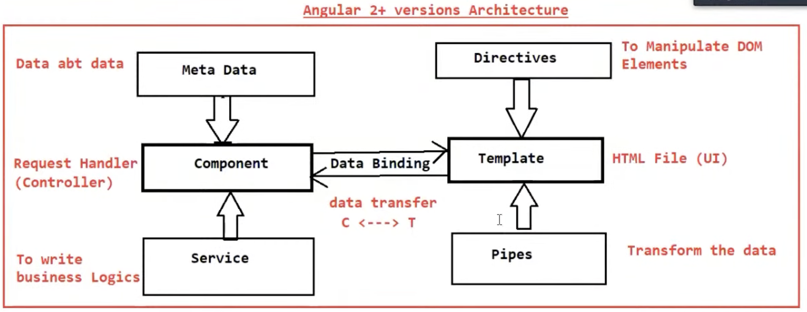

# Angular

## Angular Architecture



1. `Component` - It is a typescript class which act as a request handler.
2. `Meta data` - It describes components and template mapping.
3. `Service` - It is a typescript class which is used to write business logics.
4. `Data Binding` - It is used to transfer the data from components to template and templates to components.
5. `Template` - It is a HTML file which contains presentation logics.(UI)
6. `Directive` - It is used for DOM manipulation.
7. `Pipes` - It is used to transform data from one format to another format.

## [Angular form](https://www.youtube.com/watch?v=M6S_8J7jCPQ)

1. Template driven forms.
2. Reactive forms.

Both the approach of angular forms have few common building blocks holding the following attributes.

```
FormControl
FormGroup
FormArray
```

`FormControl` - It is used mainly for monitoring user input and authentication.

`FormGroup` - It is used for track the same values and authentication status for a collections of form control.

`FormArray` - It is used for tracking the same values and status for the array of the form control.


