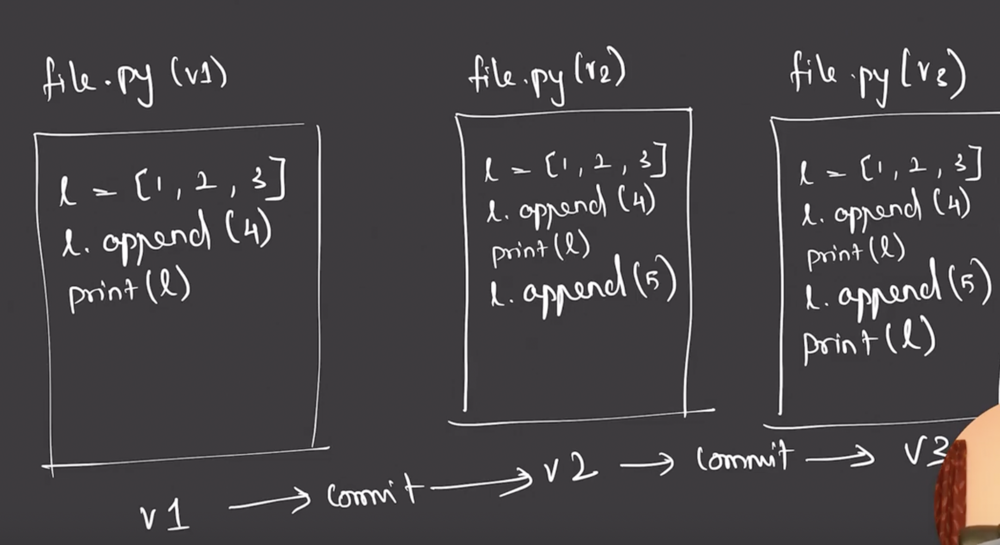
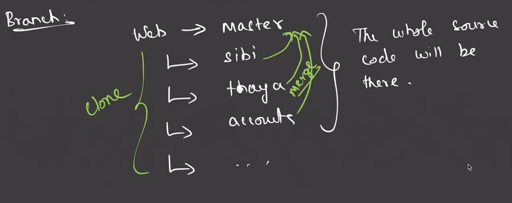
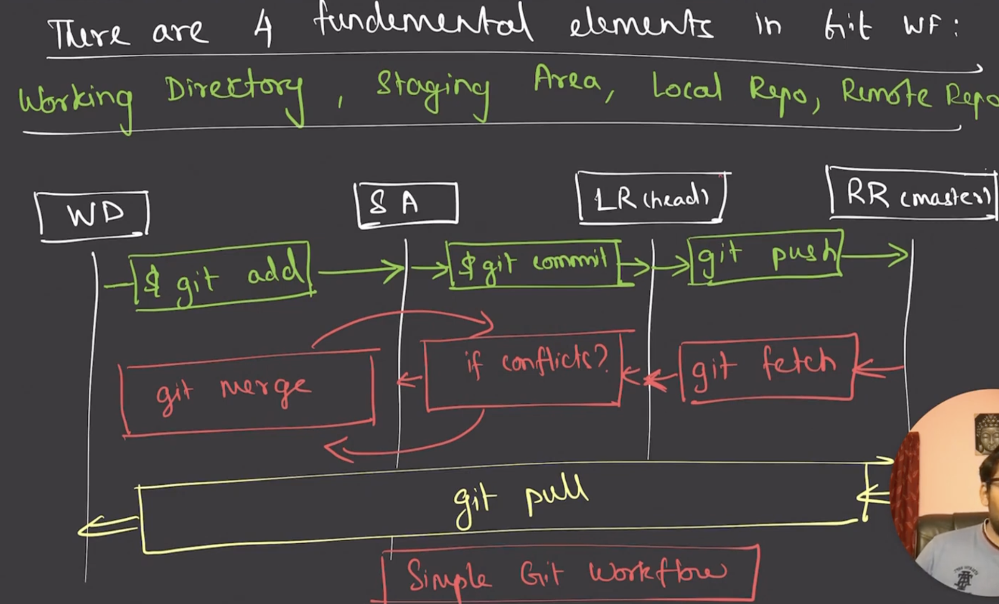

# Git

## About GIT

Git is software for tracking changes in any set of files, usually used for coordinating work among programmers collaboratively developing source code during software development. 

Git was originally authored by Linus Torvalds in 2005.

## Version control(VCS)

- It tracks the changes to a file or set of files over a period of time.
- It also used to revert changes to any specific state.

## Why version control ?

- To revert the changes to any specific state.
- To easily deploy and test specific version of code in different environment.



## GIT TERMS

*Repository*
- A set of file, directories, historical records, commits, HEADS.
- A git repo contains all the configuration, logs, branches with HEADS & more...
- All the above elements are inside a .git folder.

*Working tree*

- All the files and direcories in our repo.

*Index*

- It is the component of .git
- It is a staging area.
- It is a layer that separates your working tree from git repository.

*Commit*

- It is a snapshot of set of changes/manipulation to our working tree.

*Branch*

>MASTER BRANCH IS A MAIN PRODUCTION BRANCH



*Tag*

- It is like a bookmark, on a specific point in history.

*HEAD*

- It points to the current working directory.
```
Stages of GIT

- Untracked
- Modified
- Staged
- Committed
```

There are 4 fundamental elements in GIT.

- Working directory
- Staging area
- Local repo
- Remote repo




## Git global setup
```
git config --global user.name <username>
git config --global user.email <email>
```
## Create a new repository
```
git clone git@<URL>:<username>/<reponame>.git
cd test2
git switch -c master
touch README.md
git add README.md
git commit -m "add README"
git push -u origin master
```
## Push an existing folder

```
cd existing_folder
git init --initial-branch=master
git remote add origin git@git@<URL>:<username>/<reponame>.git
git add .
git commit -m "Initial commit"
git push -u origin master
```

## Push an existing Git repository
```
cd existing_repo
git remote rename origin old-origin
git remote add origin git@git@<URL>:<username>/<reponame>.git
git push -u origin --all
git push -u origin --tags
```

## GIT COMMANDS


`git init` -> Initialize a empty git repo.

`git remote add` -> tells local repo that who is remote.

`git remote -v` -> shows the remote repo.

`git add \<file>` -> tell what file has to move to staging area.

`git status` -> to know the status og git workflow.

`git commit -m "commit message"` -> to move staging file to local repo.

`git push` -> to move local repo into remote repo.

`git fetch` -> to get the changes from remote repo to local repo.

`git log` -> to show the history of commit.

`git log --oneline` -> to show the history of commit in oneline.

`git checkout <branchname/commithash>` -> to got to particular snapshot of a code.


