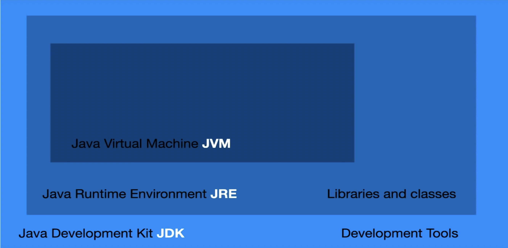
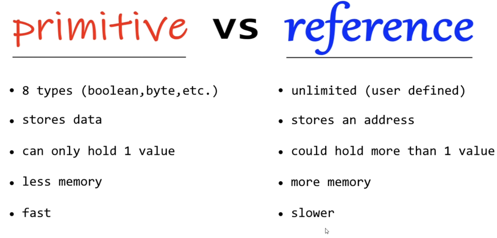

# JAVA

[Reference Link](https://www.youtube.com/watch?v=Qgl81fPcLc8)

[learnXinYminutes](https://learnxinyminutes.com/docs/java/)

[Sample Full Code](code/LearnJava.java)

Java is a general-purpose, concurrent, class-based, object-oriented computer programming language.

In 1995, first `JDK beta` is released and upon continous we have now upto Jdk 17 and on..

Companies when selecting the JDK version for the app/software, they mainly focused on the version which have long term support(LTS).

>Note: Some of the version of JAVA available without LTS.

### JDK - Java Development Kit
- It consist of all the development essential need.
### JRE - Java Runtime Environment
- It have all the libraries and toolkits.
### JVM - Java Virtual Machine
- It runs java programs.
- Ittranslate bytecode to a machine code.



## INSTALLING JDK

>brew install openjdk

## Datatypes

- Primitive datatype.
    >always start with lowercase.


- Non Primitive datatype(aka.. referencetype).
    >always start with uppercase.



## Variables
```
int x <- declaration
x = 10 <- assignment

int x = 10 <- initialization
```

## Wrapper class
```
Wrapper class provides  a way to user primitive datatypes as a reference data type.
```

### Why user Wrapper class ?
```
Wrapper class have some useful methods and can be used with collections. Ex: ArrayList.
```

Primitive datatype -> Reference datatype
- int       -> Integer
- boolean   -> Boolean
- char      -> Character
- double    -> Double

### Autoboxing
```
The automatic conversion that the Java compiler makes between the primitive datatypes and their corresponding object wrapper class.
```

### Unboxing
```
The reverse of Autoboxing.

Automatic conversion of wrapper class to primitive datatypes.

Note: We can very well treat wrapper class type as primitive datatypes.
```

# OOP

### [Object](https://docs.oracle.com/javase/tutorial/java/concepts/index.html)
```
Object is an instance of the class that may contain attributes and methods.
```
### [Constructor]()
```
Constructor is a special method that is called when an object is instantiated(created).
```
### Variable Scope
---
1. `Local variable` declared inside a method and its visible only ot that method.
2. `Global variable` is declared outside a method but within a class visible to all parts of a class.

### Static keyword
- `Static` = modifier. A single copy of a variable/method is created and shared.
- The `class` owns the static member.

### Super keyword
- `Super` = keyword refers to the super class(parent) of an object.
- Similar to this keyword.
    - `Super` refer parent class.
    - `this` refer current class.

### Abtract class

- `abstract` class cannot be instantiated but it can have a sub class.
- abstract methods can be declared without an implementation(without a body content).
- This ability makes us to implement a method inside a subclass(like it is a mandatory).

### Access Modifiers


### Encapsulation

- Attributes of a class will be hidden or private.
- Can be access through only methods - Getters & Setters.
- You should make attributes private, if you don't have reason to be public/protected.

### Interface

- `interface` is a template that can be applied to  a class.
- similar to inheritance, but specifies what a class must do.
- classes can apply to more than 1 interface, whereas inheritance is limited to 1 super class.


