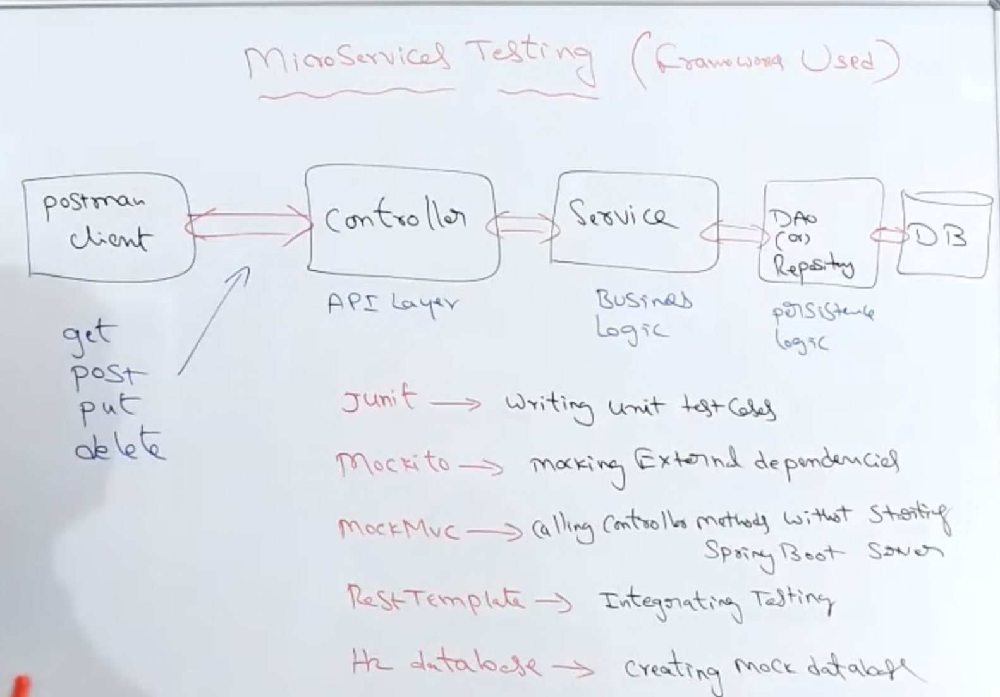

# [Microservices](https://www.youtube.com/watch?v=sZKzpHkJ-xw&list=PLUDwpEzHYYLtg-RO06RVFsauoAv241TNE)

There are two architecture followed in the Applications.

1. Monolithic
2. Microservice

## Monolithic Architecture

- The services which are provided by the application will be installed and deployed in the single server.

- Mainly the whole application will bundled into single JAR/WAR file, which contains everything

### Advantages

- It is easy to develop, testing and deploy.
- Low complexity to establish architecture.

### Disadvantages

- Tightly coupled(Rigid).
- Hard to scale.
- Slow performance.
- Slow continuous development.
- Single point of failure.
- Mixed technology stack is not possible.

## Microservice Architecture

- In microservice, the whole application will be divided into multiple tiny parts.
- Each parts will have their own API's and dedicated database.

### Advantages

- Loosely coupled(Every component is independent).
- Agile and flexible. 
- Independent development and deployment.
- Fault isolation.
- Mixed technology stack is possible.

## Disadvantages

- High complexity - Maintaining all the API's, servers and databases are bit complex when compared to Monolithic.
- Consistency.
- Automation.
- Debugging will be bit tougher.

## When to use Microservice & Monolithic ?

`Monolithic` - Consider if your team consist of very small number of people(small company/small project) and you do not do enhancement continuously and less complexity involved.

`Microservice` - If your application is very big and consist of large number of modules with so many services are running and need lot of enhancement continuously.

## How to test ?

1. `JUnit` - For Unit testing purpose.
- Junit is a free and open source Unit Testing framework for Java applications.
- It was developed by Kent Beck and Erich Gamma.
- First version was released in 1997.

2. `Mockito` - We can mock the external dependencies.

- It is a Unit test framework.
- For example, consider we are sending `getAllCountries` request.
- It will send a `GET` request and flow will be,

    Flow : `Controller->Service->Repository->Database`

- We can mock the repository and database with mockito, basically we can test our service class without repository and database.

    ### **What is Mocking ?**

- Mocking is the process used in testing when the unit being tested has an external dependencies. 
- In other words, the process of creating substitute object for the real object is called Mocking.

- Two types
    - Stub Based Mock Framework(Easy Mock).
    - Bytecode Manipulation Based Mock Framework(Power Mock).

3. `MockMVC` - Used for invoking the controller method without starting the spring boot server.

- We can use MockMVC along with mockito as well.
- MockMVC is not required when using mockito.
- Additionally why we use MockMVC is when we don't want to start spring boot server and wants to invoking the controller methods.

4. `RestTemplate` - To perform Integration testing between layers.

5. `H2 Database` - If we don't have a real database, we can mock the H2/In memory database.

## Spring Boot

Spring boot provides a numerous of utilities and annotations to help when testing your application.

Test support is provided by two modules

- `spring-boot-test`
- `spring-boot-test-autoconfigure`

