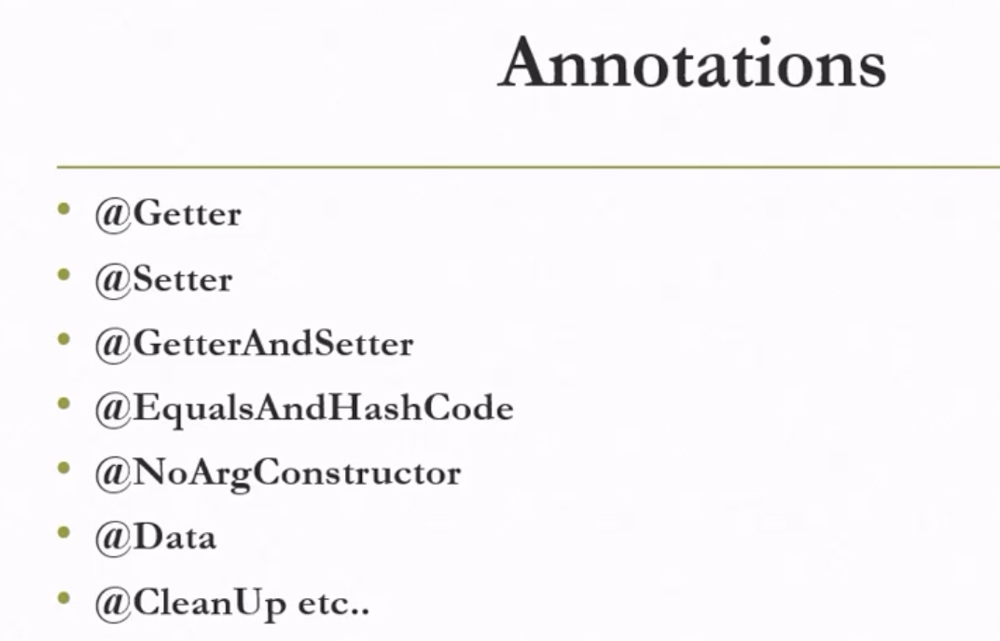

# Spring Boot

[Spring Boot Project](https://github.com/praveen-raja/Spring-Boot-Project)

### What is spring Boot ?

Spring boot is an approach to develop spring based application with minimal configurations.

### What is code coverage ?

- Code coverage is a metric that can help us to understand how much of our source code is tested.
- It helps to measure the efficiency of test implementation.
- Using code coverage report we can see which lines are missed in the unit testing.
- Jacoco is one of the famous software available for testing code coverage of java applications.

### **Lombok**

[Lombok Download](https://projectlombok.org/download)

Lombok Maven [dependency](https://projectlombok.org/setup/maven)

`BoilerPlate Code`

 - It is a term used to describe code that is repeated in many parts of an application with little alteration.
 - Project Lombok main aim is to avoid boilerplate code in programs by replacing with simple set of annotations.

 [LombokDemo](https://github.com/praveen-raja/Spring-Boot-Project/tree/master/LombokDemo) Project.

 

 ## **SonarQube**

  
