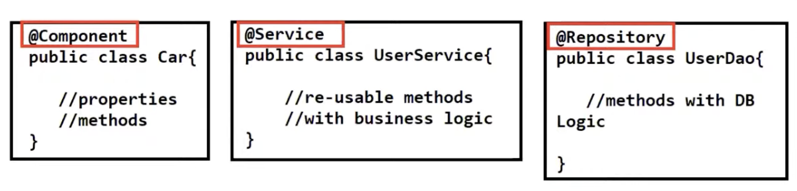
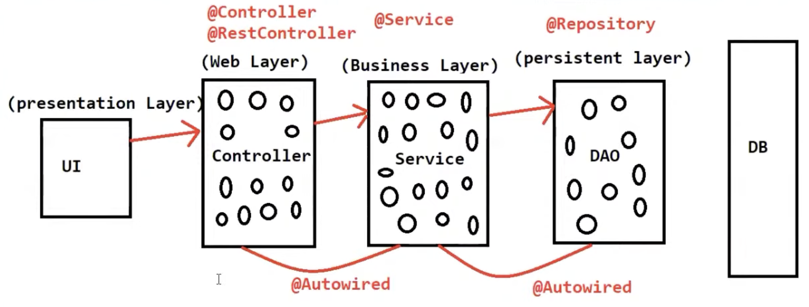

# [Spring Annotations](https://www.youtube.com/watch?v=BdjSAz3v41k)

### What is annotations ?

- Annotation is used to provide meta data.
- From java 1.5 version, we have annotation support.
- Earlier that people used to work with XML files for configuration.
- Annotation came into market as an alternate for XML configurations.
- Spring and springboot also support annotation.

### What is spring bean ?

- Dependency injection is the fundamental concept of the spring framework.
- Java class which is managed by IoC container is called as spring bean.
### What is IoC container

Spring IoC Container is the **core of Spring Framework**. It creates the objects, configures and assembles their dependencies, manages their entire life cycle. The Container uses Dependency Injection(DI) to manage the components that make up the application.

### How to represent java class as a spring bean ?

1. Using XML configuration, like below
```xml
<bean id="car" class="com.beans.Car"></bean>
```
>XML configuration is outdated
2. Annotations
    - @Component
    - @Service
    - @Repository
>By using anyone of the above annotation we can represent or create a spring bean.

- These 3 repositories are class level annotation.


It is a spring recommendation to use appropriate annotation for appropriate classes.

3. Why we need to represent java class a spring bean ?
>Dependency management will be taken care by IoC containers.
---
# Overview
